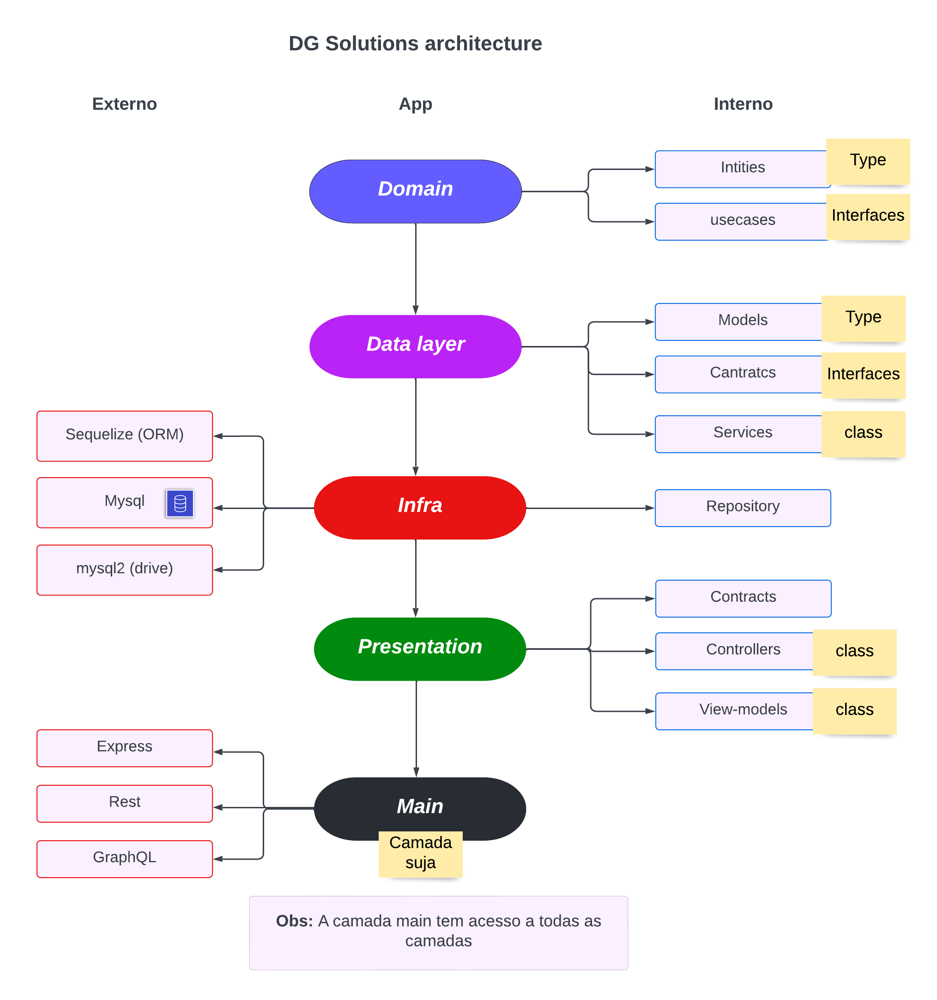

# WA Projects

Domunentação: <a href="https://github.com/leodeymison/wa-p/wiki">Aqui</a>

## Infra


<p>
    My main goal of using clean architecture is to make the application not dependent on anything external, thus making it easier to maintain, test and change a technology.
</p>

### Request and response flow

Before

```ts
export default (router: Router):void => {
  router.get('/films', async (req,res) => {
    const repo = new GetFilmsRepository()
    const loader = new GetFilmsService(repo)
    const controller = new getFilmsController(loader)
    const httpResponse = await controller.handle(parseInt(`${req.query.page}`))
    res.status(httpResponse.statusCode).json(httpResponse.data)
  }),
}
```

After

```ts
export default (router: Router):void => {
  /* @/data/routes */
  router.get("/films", adaptRouteFilmsAll(makeControllerGetAllFilms())),
  export default (router: Router): void => {
};

export const adaptRouteFilmsAll = (controller: controller) => {
    /* @/data/adapter */
    return async (req: Request, res: Response) => {
        const httpResponse = await controller.handle(parseInt(`${req.query.page}`));
        res.status(httpResponse.statusCode).json(httpResponse.data);
    };
};

export const makeControllerGetAllFilms = (): controller => {
    /* @/data/factory */
    const repo = new GetFilmsRepository()
    const loader = new GetFilmsService(repo)
    return new getFilmsController(loader)
};
```

## Dependencies

- Mongodb
- yarn

## Informations

- Banco de dados:

  - mongoDB - recommended
  - mysql

- Requisition type

  - Rest
  - GraphQL

- Architecture
  - Clean architecture

## Initialization

```js
yarn;
```

```js
/* Create .env and change information */
```

```js
yarn dev
```

```js
Graphql:
http://localhost:5000/graphql

Rest:
// all
http://localhost:5000/v1/films

// 10 out of 10
http://localhost:5000/v1/films?page=1

// One
http://localhost:5000/v1/films/:id
```

## Documentation
