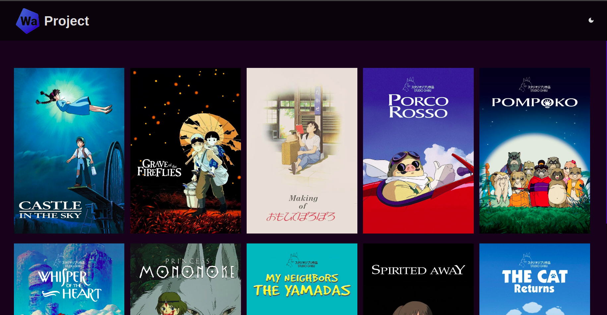
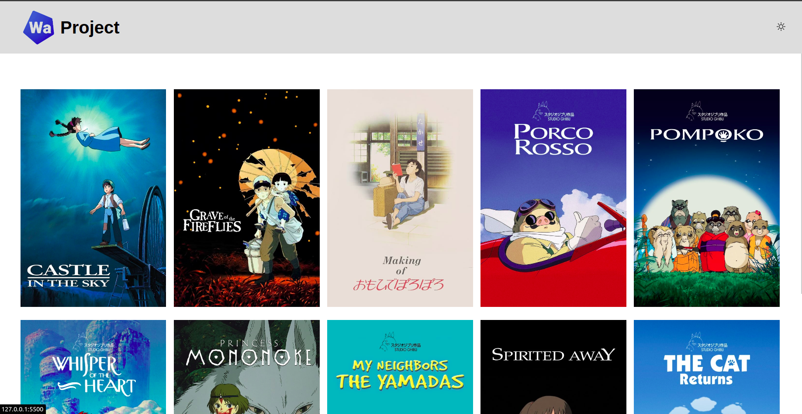

# Meu site

<a href="https://leodeymison-a.netlify.app/">Link do site</a>

<br />

## Themes

Dark:


Light:


<br />
<hr />

## Start

### Step 01: <br />

```js
yarn;
```

### Step 02: <br />

```js
yarn dev
```

### Step 03: <br />

```js
# Plugin do vscode Live Server
> Go live
```
